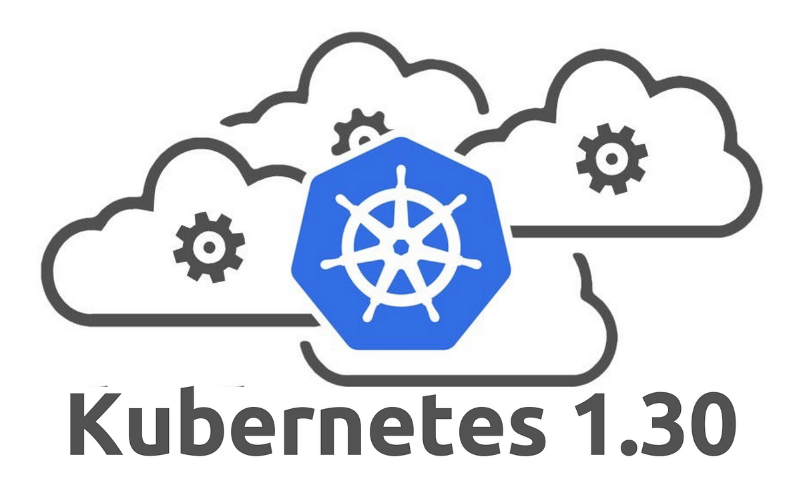

# Certified Kubernetes Application Developer (CKAD) Study Guide 2024 ( Updated September 2024)

The [Certified Kubernetes Application Developer (CKAD) certification](https://www.cncf.io/certification/ckad/) exam certifies that candidates can design, build and deploy cloud-native applications for Kubernetes.

Not sure where to start? You may consider reviewing our suggested CKAD learning path.

EXAM SIMULATOR! Learners will now have access to an exam simulator, provided by Killer.sh, to experience the exam environment. You will have two exam simulation attempts (36 hours of access for each attempt from the start of activation).
Simulation includes 20-25 questions (which are exactly the same for every attempt and every user (unlike those found on the actual exams) and graded simulation results).

# 💰💰 [30% OFF] Kubernetes Certification Coupon CKAD 

Save 30% using Coupon code **TECK30** on all the Linux Foundation training and certification programs. This is a limited-time offer for this month. This offer is applicable for CKA, CKAD, CKS, KCNA, LFCS, PCA FINOPS, NodeJS, CHFA, and all the other certification, training, and BootCamp programs.

-  Kubernetes CKAD VOUCHER ($395 —> $276): [kube.promo/ckad](https://teckbootcamps.com/go/ckad-exam-2024/)

# CKAD Questions And Responses ( Updated Kubernetes 1.30 )

A set of exercises based on last Kubernetes version (1.30) that help you prepare for the [Certified Kubernetes Application Developer](https://www.cncf.io/certification/ckad/) exam.

They may as well serve as learning and practicing with Kubernetes.

During the exam, you are only allowed to refer to official documentation from a browser window within the exam VM.
A Quick Reference box will contain helpful links for each exam exercise as well.

## CKAD Exam Syllabus (Kubernetes 1.30) 
- [Application Design and Build - 20%](a.application_design_build.md)
- [Application Environment, Configuration, and Security - 25%](b.application_environment_configuration_security.md)
- [Services & Networking - 20%](c.services_networking.md)
- [Application Deployment - 20%](d.application_deployment.md)
- [Application Observability and Maintenance - 15%](e.application_observability_maintenance.md)

## Additional Resources
* 💬 [Kubernetes Slack Channel #certifications](https://kubernetes.slack.com/)Slack
* 📚 [Mohamed BEN HASSINE: Guide to Kubernetes Application Development](https://teckbootcamps.com/ckad-exam-study-guide/)Blog
* 🎞️ [KodeKloud: Certified Kubernetes Application Developer (CKAD)](https://kodekloud.com/p/kubernetes-certification-course)Blog
* 🎞️ [Udemy: CKAD Certified Kubernetes Application Developer Crash Course](https://www.udemy.com/course/ckad-certified-kubernetes-application-developer/)Blog

## 💬 Share To Your Network
If this repo has helped you in any way, feel free to share !

