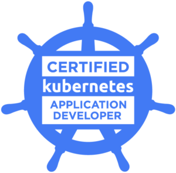

# Certified Kubernetes Application Developer (CKAD) Study Guide for December 2024 

The [Certified Kubernetes Application Developer (CKAD) certification](https://www.cncf.io/certification/ckad/) exam certifies that candidates can design, build and deploy cloud-native applications for Kubernetes.

## CKAD Exam details

| **CKAD Exam Details**                     | **Information**                                                                                     |
|-------------------------------------------|-----------------------------------------------------------------------------------------------------|
| **Exam Type**                             | Performance based ( NO MCQ )                                                                                            |
| **Exam Duration**                         | 2 hours                                                                                            |
| **Pass Percentage**                       | 66%                                                                                                |
| **CKAD Exam Kubernetes Version**          | Kubernetes v1.31                                                                                 |
| **CKAD Validity**                         | 2 Years  |
| **Exam Cost**                             | $395 USD (GET 30% OFF using Coupon **TECK30**)  💥INCREASE PRICE:  $434 in January 2025 |

## 💰💰 [30% OFF] Kubernetes Certification Coupon CKAD 

Save 30% using Coupon code **TECK30** on all the Linux Foundation training and certification programs.
This is a limited-time offer for this month. This offer is applicable for CKA, CKAD, CKS, KCNA, LFCS, PCA FINOPS, NodeJS, CHFA, and all the other certification, training, and BootCamp programs.
Check latest offers on Kubernetes Exam Coupons : [Kubernetes Vouchers ](https://github.com/teckbootcamps/linux-foundation-coupon)

## CKAD Questions And Responses ( Updated Kubernetes 1.31 ) : On Going

A set of exercises based on last Kubernetes version (1.31) that help you prepare for the [Certified Kubernetes Application Developer](https://www.cncf.io/certification/ckad/) exam.

They may as well serve as learning and practicing with Kubernetes.

During the exam, you are only allowed to refer to official documentation from a browser window within the exam VM.
A Quick Reference box will contain helpful links for each exam exercise as well.

## CKAD Exam Syllabus (Kubernetes 1.31) 

| **Topic**                                 | **Concepts**                                                                                                                                                       | **Weightage** |
|-------------------------------------------|-------------------------------------------------------------------------------------------------------------------------------------------------------------------|---------------|
| [**Application Design and Build - 20%**](a.application_design_build.md)          | 1. Define, build, and modify container images 2. Understand Jobs and CronJobs 3. Understand multi-container Pod design patterns (e.g., sidecar, init, others) 4. Utilize persistent and ephemeral volumes | 20%          |
| [**Application Environment, Configuration, and Security - 25%**](b.application_environment_configuration_security.md) | 1. Discover and use resources that extend Kubernetes (CRD) 2. Understand authentication, authorization, and admission control 3. Understand and define resource requirements, limits, and quotas 4. Understand ConfigMaps 5. Create & consume Secrets 6. Understand ServiceAccounts 7. Understand SecurityContexts | 25%          |
| [**Services & Networking - 20%**](c.services_networking.md)                | 1. Understand API deprecations 2. Implement probes and health checks 3. Use provided tools to monitor Kubernetes applications 4. Utilize container logs 5. Debugging in Kubernetes | 20%          |
| [**Application Deployment - 20%**](d.application_deployment.md)               | 1. Use Kubernetes primitives to implement common deployment strategies (e.g., blue/green or canary) 2. Understand Deployments and perform rolling updates 3. Use Helm package manager to deploy existing packages | 20%          |
| [**Application Observability and Maintenance - 15%**](e.application_observability_maintenance.md) | 1. Understand API deprecations 2. Implement probes and health checks 3. Use provided tools to monitor Kubernetes applications 4. Utilize container logs 5. Debugging in Kubernetes | 15%          |

## CKAD Exam Practice Labs

The best way to prepare is to practice a lot! The setups below will provide you with a Kubernetes cluster where you can perform all the required practice. The CKAD exam expects you to solve problems on a live cluster.

> **Note:** CKAD does not include any multiple-choice questions (MCQs). Hands-on practice is essential!

### Recommended Practice Tools

1. [**Killercoda**](https://killercoda.com): An online interactive platform to practice Kubernetes and other DevOps tools in a realistic environment.
2. [**Minikube**](https://minikube.sigs.k8s.io): A tool that lets you run a Kubernetes cluster locally, ideal for individual practice on your local machine.

## Additional Resources

* 📚 Guide to Kubernetes Application Development](https://teckbootcamps.com/ckad-exam-study-guide/)Blog
* 💬 [Kubernetes Slack Channel #certifications](https://kubernetes.slack.com/)Slack
* 🎞️ [Udemy: CKAD Certified Kubernetes Application Developer Crash Course](https://www.udemy.com/course/ckad-certified-kubernetes-application-developer/)Blog

## 💬 Share To Your Network
If this repo has helped you in any way, feel free to share and star !

