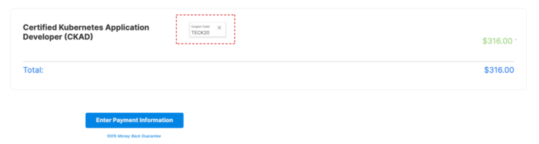
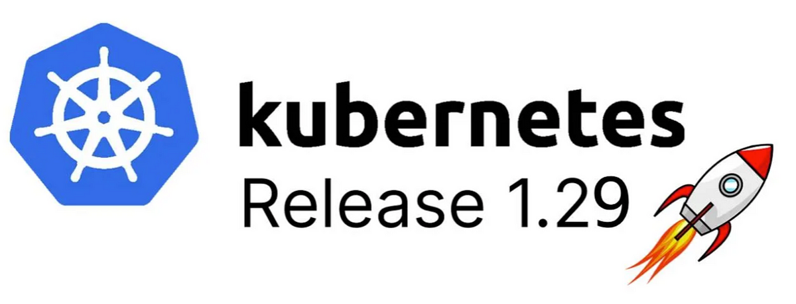

# Certified Kubernetes Application Developer (CKAD) Study Guide 2024

The [Certified Kubernetes Application Developer (CKAD) certification](https://www.cncf.io/certification/ckad/) exam certifies that candidates can design, build and deploy cloud-native applications for Kubernetes.

Not sure where to start? You may consider reviewing our suggested CKAD learning path.

EXAM SIMULATOR! Learners will now have access to an exam simulator, provided by Killer.sh, to experience the exam environment. You will have two exam simulation attempts (36 hours of access for each attempt from the start of activation). Simulation includes 20-25 questions (which are exactly the same for every attempt and every user (unlike those found on the actual exams) and graded simulation results).

UPCOMING POLICY CHANGE: Please note that our Certification Period Policy is changing effective April 01, 2024, 00:00UTC. Certifications achieved on or after this date will expire 24 months from the date the program certification requirements, including passing the exam, are met. We encourage anyone interested and prepared to schedule and take your exam before the policy change. Please see additional details here.

# Register for the CKAD Certification [Save 20% Today]
To begin your journey of becoming a Certified Kubernetes Application Developer (CKAD) – start by registering for the CKAD exam on the Linux Foundation portal. When you register you get free access to two sessions of killer.sh CKAD practice exams that will help you clear the CKAD exam.

Register today and use our exclusive coupon code TECK20 for the CKAD exam to get a 20% discount on CKAD (and KCNA, CKA, and CKS certifications ). This code "TECK20" expires soon.

💰💰 [GET 20% OFF ON KUBERNETES CKAD VOUCHER $395 --> $316](https://teckbootcamps.com/linux-foundation-coupons/#%f0%9f%94%a5-20-off-kubernetes-certification-coupon-ckad-cka-cks-running-now)

# CKAD Questions And Responses ( Updated Kubernetes 1.29 )

A set of exercises based on last Kubernetes version (1.29) that help you prepare for the [Certified Kubernetes Application Developer](https://www.cncf.io/certification/ckad/) exam.

They may as well serve as learning and practicing with Kubernetes.

During the exam, you are only allowed to refer to official documentation from a browser window within the exam VM.
A Quick Reference box will contain helpful links for each exam exercise as well.

📚 [GET Kubernetes 1.29 New features (Blog Post): ](https://teckbootcamps.com/an-overview-of-new-features-in-kubernetes-v1-29/) 

## CKAD Exam Syllabus (Kubernetes 1.29) 
- [Application Design and Build - 20%](a.application_design_build.md)
- [Application Environment, Configuration, and Security - 25%](b.application_environment_configuration_security.md)
- [Services & Networking - 20%](c.services_networking.md)
- [Application Deployment - 20%](d.application_deployment.md)
- [Application Observability and Maintenance - 15%](e.application_observability_maintenance.md)

## Additional Resources
* 💬 [Kubernetes Slack Channel #certifications](https://kubernetes.slack.com/)
* 📚 [Mohamed BEN HASSINE: Guide to Kubernetes Application Development](https://teckbootcamps.com/ckad-exam-study-guide/)
* 🎞️ [KodeKloud: Certified Kubernetes Application Developer (CKAD)](https://kodekloud.com/p/kubernetes-certification-course)
* 🎞️ [Udemy: CKAD Certified Kubernetes Application Developer Crash Course](https://www.udemy.com/course/ckad-certified-kubernetes-application-developer/)

## 💬 Share To Your Network
If this repo has helped you in any way, feel free to share !

## 💬 Author
* 👨 🇹🇳 [Aboute ME : Mohamed BEN HASSINE : ](https://teckbootcamps.com/about-me/)
* 👨 [Contact ME in LinkedIn ](https://www.linkedin.com/in/mohamedbnhassine/)
* ☸ ☸ 3X Certified Kubernetes([CKAD](https://teckbootcamps.com/ckad-exam-study-guide/), [CKA](https://teckbootcamps.com/cka-exam-study-guide//) ,[CKS](https://teckbootcamps.com/cks-exam-study-guide/))
* ☁️ ☁️ Google Cloud Solutions Architect ||  [4X certified GCP Cloud](https://www.credential.net/profile/mohamedbenhassine968370/wallet)
* 👨🏼‍💻 👨🏼‍💻 14+ years of experience in the tech

